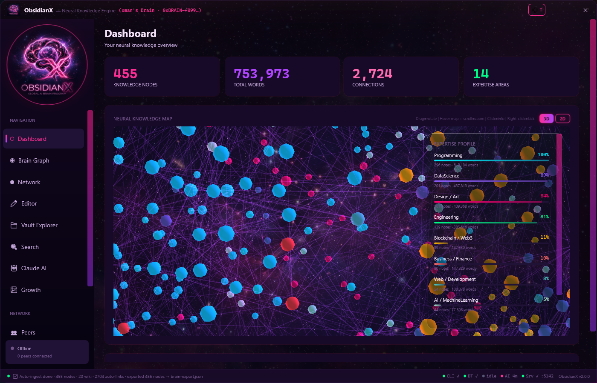
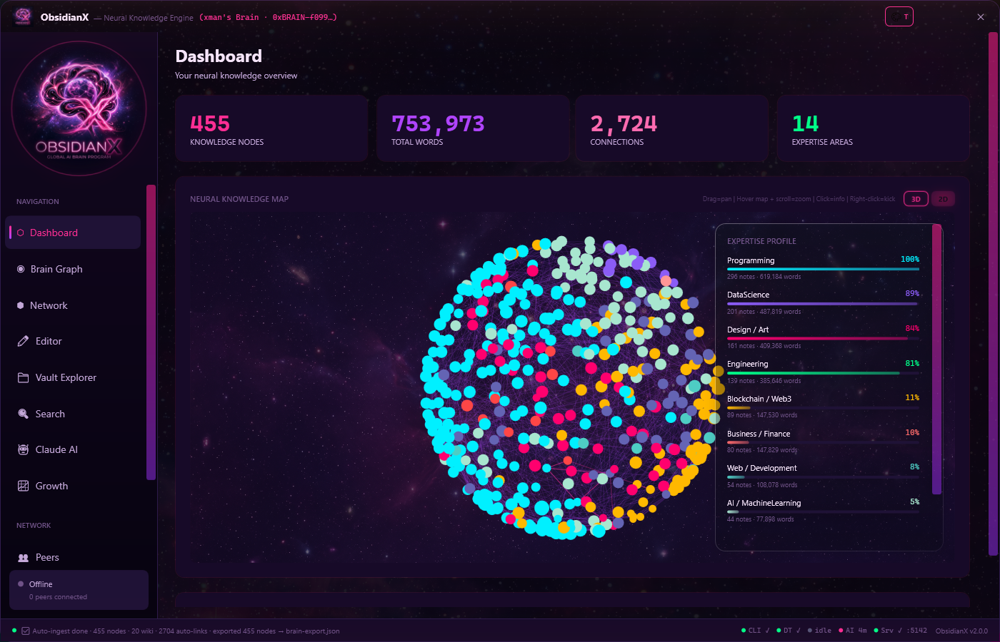
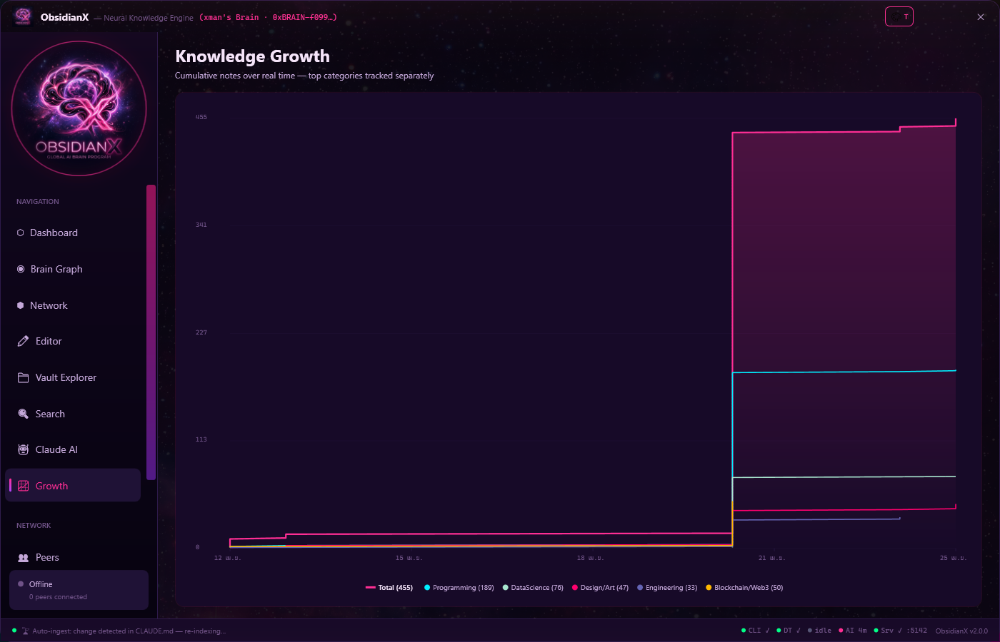
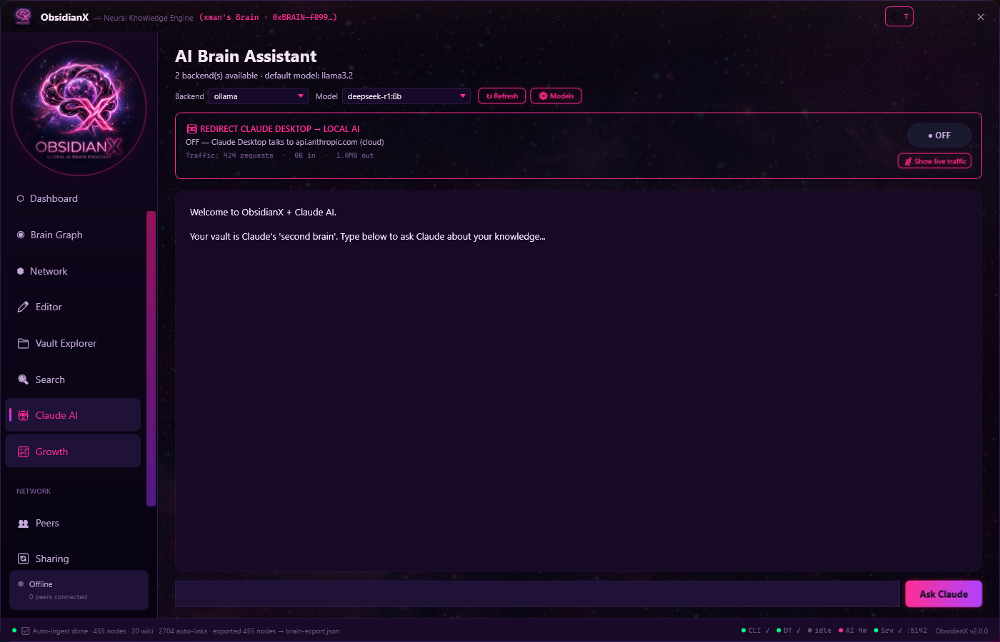

# ObsidianX — Neural Knowledge Network

<div align="center">

```
   ____  _         _     _ _             __  __
  / __ \| |__  ___(_) __| (_) __ _ _ __ \ \/ /
 | |  | | '_ \/ __| |/ _` | |/ _` | '_ \ \  /
 | |__| | |_) \__ \ | (_| | | (_| | | | |/  \
  \____/|_.__/|___/_|\__,_|_|\__,_|_| |_/_/\_\
```

**A futuristic 3D knowledge brain with peer-to-peer sharing, MCP-native Claude integration, and a 137-model AI Hub.**

*Your Markdown vault becomes a living, physics-driven 3D graph. Claude treats it as a second brain. The brain heals itself.*

[](https://dotnet.microsoft.com/)
[](https://learn.microsoft.com/en-us/dotnet/desktop/wpf/)
[](https://learn.microsoft.com/en-us/aspnet/core/signalr/)
[](https://modelcontextprotocol.io/)
[](LICENSE)

</div>

---

## See it in motion

> **Dashboard — 3D mode**, with the glassmorphism Expertise Profile overlay floating on top of a live force-directed graph. Each node is a Markdown note; each edge is a `[[wiki-link]]` or an auto-detected semantic relation. Translucent cluster bubbles wear a colored equator ring for their dominant category, so the brain's regions read at a glance.



> **Same data, 2D mode** — one click from the toolbar swaps to a `DrawingContext`-based renderer that handles thousands of nodes without breaking a sweat. Nodes are colored by `KnowledgeCategory`, so Programming nodes are cyan, Design is pink, Engineering is green, etc. Pan with drag, zoom with wheel.



> **Knowledge Growth** — a real time-series of when notes were actually written, not a snapshot. The pink line is the cumulative total; thinner lines split out the top expertise categories. The vertical staircase reveals "burst learning" days vs slow weeks.



> **AI Brain Assistant** — pick a backend (local Ollama or one of 130+ cloud models from NVIDIA NIM, OpenRouter, DeepSeek), ask anything. The vault is the system prompt. Optional **traffic redirect** quietly forwards Claude Desktop calls to a local model so your private brain never leaves your machine.



---

## What is ObsidianX?

ObsidianX is a **complete Obsidian replacement** that turns a Markdown vault into:

- a **living 3D brain** you can rotate, zoom, and dive into
- a **2D fallback** that's blazingly fast at any node count
- a **MCP server** that hands the vault to Claude Desktop and Claude Code as a first-class tool surface
- a **137-model AI Hub** local + cloud, with one-click model swap
- a **peer-to-peer mesh** where brains find each other by expertise and share knowledge under consent
- an **auto-healing process tree**: open Claude → MCP starts → Client launches → Server boots → all green, all the time

Three processes, one chain:

```
Claude Desktop ──spawns──► obsidianx-mcp ──spawns──► ObsidianX.Client ──spawns──► ObsidianX.Server
                              (stdio MCP)              (WPF, 3D + 2D)              (Kestrel :5142)
                                                                                          │
                                                                                          └─ AI Hub: Ollama + NVIDIA NIM
                                                                                             + OpenRouter + DeepSeek
```

If any link is missing, the next one to come up resurrects it. **The user never has to babysit services.**

## What's new

### Visualization & UX
- 🪟 **Glassmorphism overlay** for the Expertise Profile — frosted-glass card sitting on top of the map, scrollable when categories grow
- 🎚️ **3D ↔ 2D toggle** on both the Dashboard map and the full Brain Graph view; 2D path uses retained-mode `DrawingContext` and stays smooth at 1000+ nodes
- 🎯 **Fit-to-view camera** on first load — bounding-sphere math frames the whole graph instead of opening on a zoomed-in slice
- 🖱️ **Hover-scoped wheel zoom** — wheel only zooms when the cursor is over the map, dashboard scroll is unaffected
- 🔵 **Translucent cluster bubbles** with **category-colored equator rings** — clicks land on nodes inside, the bubble is a hint not a wall
- 🎨 **Categorical 2D coloring** — every node colored by its `KnowledgeCategory`, you can read the brain's regions at a glance

### Knowledge & charts
- 📈 **Knowledge Growth as a real time-series** — cumulative line chart over actual `CreatedAt` dates, with per-category sub-lines and locale-aware date axis
- 🧮 **Honest expertise scoring** — relative-to-max ranking instead of the previous `min(1, sum/10)` clamp that pinned everything to 100%
- 🪶 **Self-healing CLAUDE.md** — auto-managed `<!-- BRAIN:BEGIN/END -->` section keeps stats fresh on every export, never bloats the file
- 🧠 **Real Brain camera mode** — lifecycle-aware attention scoring (birth / edit / death events steer the camera in addition to MCP access pulses)

### Services & install
- 🫥 **Server runs hidden** — no console window, drained stdout/stderr, surfaced through a click-to-open status chip in the status bar
- 🔁 **Auto-launch chain** — MCP launches the Client by newest-mtime; Client launches the Server by newest-mtime; everything self-spawns when Claude opens
- 🚀 **WPAD-free HttpClient** — every localhost call disables proxy auto-detect, eliminating 5-10 second timeouts on first paint
- 🔧 **Self-installing Claude memory rules** — on first run, the Client seeds `~/.claude/projects/<vault>/memory/` with the project's brain-save policy, with a version field so future Client builds upgrade transparently
- 🖥️ **Multi-resolution icon + auto-shortcut** — first launch creates a Desktop shortcut pointing at the freshest build, self-heals if the build folder moves

### MCP & AI
- 🛰️ **MCP server** (stdio) ships brain tools to Claude: `brain_search`, `brain_create_note`, `brain_append_note`, `brain_remember`, `brain_expertise`, `brain_list`, `brain_stats`, `brain_get_note`, `brain_import_path`
- 🪵 **Auto-journal** — every MCP tool call lands in `.obsidianx/sessions/<date>.md`, so Claude can review what it did without you asking
- 🌐 **AI Hub** — single API surface over Ollama (local) + NVIDIA NIM (free tier, Llama 4 / GPT-OSS / DeepSeek / Qwen / Gemma) + OpenRouter + DeepSeek; backend + model picker + per-router stats
- 🪞 **Claude redirect mode** — toggle Claude Desktop traffic to a local model with full visibility of in/out bytes and request count

## ObsidianX vs Obsidian

| Feature | Obsidian | ObsidianX |
|---------|----------|-----------|
| Markdown editor | Yes | Yes (AvalonEdit + cyberpunk theme) |
| `[[wiki-links]]` | Yes | Yes (Ctrl+Click + auto-update on rename) |
| Backlinks | Yes | Yes (panel with surrounding context) |
| Full-text search | Yes | Yes (highlighted matches) |
| Quick switcher | Ctrl+O | Ctrl+O |
| Graph view | 2D, static | **3D physics + 2D fast renderer + toggle** |
| Knowledge growth | — | **Time-series line chart over real dates** |
| Expertise visualization | — | **24 categories ranked relative-to-strongest** |
| MCP-native | — | **Claude Desktop + Claude Code talk to your brain directly** |
| Auto-save findings | — | **Brain saves non-trivial Claude session insights as notes** |
| Local AI | — | **Ollama integration, picker UI, traffic stats** |
| Cloud AI | — | **NVIDIA NIM + OpenRouter + DeepSeek** |
| Crypto identity | — | **ECDSA wallet-style brain addresses** |
| P2P sharing | — | **SignalR mesh + expertise matching + consent flow** |
| Server dashboard | — | **Cyberpunk web UI at :5142** |

## Architecture

```
ObsidianX/
├── ObsidianX.Core/              # Shared models & services (.NET 9)
│   ├── Models/
│   │   ├── BrainIdentity.cs        # ECDSA crypto identity
│   │   ├── KnowledgeNode.cs        # Graph nodes & edges
│   │   ├── KnowledgeCategory.cs    # 24 categories + ExpertiseScore
│   │   └── PeerInfo.cs             # Peer & sharing models
│   └── Services/
│       ├── KnowledgeIndexer.cs     # Vault scanner & categorizer
│       ├── BrainExporter.cs        # JSON export + CLAUDE.md splice
│       └── ClaudeIntegration.cs    # First-run CLAUDE.md scaffold
│
├── ObsidianX.Client/            # WPF Desktop App (.NET 10)
│   ├── App.xaml.cs                 # Auto-shortcut + icon-cache refresh
│   ├── MainWindow.xaml / .cs       # 11 views, 3D + 2D viewports, status bar
│   └── Services/
│       ├── PhysicsEngine.cs            # Force-directed + Barnes-Hut
│       ├── Graph2DRenderer.cs          # Retained-mode 2D fallback
│       ├── ClaudeBrainRulesInstaller.cs # First-run memory seeding
│       ├── VaultWatcher.cs             # FileSystemWatcher → diff-load
│       ├── ClusterTree.cs              # Fractal cluster hierarchy
│       └── NetworkClient.cs            # SignalR client
│
├── ObsidianX.Mcp/               # MCP server for Claude (.NET 9, stdio)
│   └── Program.cs                  # JSON-RPC, brain tools, auto-journal,
│                                   # newest-mtime Client launcher
│
└── ObsidianX.Server/            # ASP.NET Core Server (.NET 10)
    ├── Program.cs                  # REST + SignalR + AI Hub
    ├── Hubs/BrainHub.cs            # Matchmaking + sharing protocol
    ├── Services/AiRouter.cs        # Ollama / NIM / OpenRouter / DeepSeek
    └── wwwroot/index.html          # Cyberpunk web dashboard
```

### Client views

| View | Description |
|------|-------------|
| **Dashboard** | Stats, full-width 3D/2D map, glass Expertise overlay, address card, status chips |
| **Brain Graph** | Full-screen 3D + 2D toggle, FPS counter, camera modes (Free / Follow / Orbit / Overview / Random Walk / Real Brain) |
| **Knowledge Growth** | Time-series line chart of cumulative notes per category over real calendar dates |
| **Editor** | Split Markdown editor + live preview + backlinks panel |
| **Vault Explorer** | Tree view with create / rename / delete and wiki-link auto-update |
| **Search** | Full-text search across the vault with highlighted match context |
| **Claude AI** | Chat with backend / model picker, streaming output, redirect toggle |
| **Network** | Connect / disconnect, expertise matching, peer results |
| **Peers** | Online peers — avatar, address, expertise tags |
| **Sharing** | Incoming requests (accept / reject) + sharing history |
| **Settings** | Brain identity, vault path, server URL, AI keys, MCP registration, storage backend |

## Prerequisites

- [.NET 10 SDK](https://dotnet.microsoft.com/download) (Core targets .NET 9; Client + Server target .NET 10)
- Windows 10/11 (WPF requirement)
- Optional: [Ollama](https://ollama.com/) for fully local AI; an NVIDIA NIM / OpenRouter / DeepSeek key for cloud models

## Getting started

```bash
git clone https://github.com/xjanova/ObsidianX.git
cd ObsidianX
dotnet build ObsidianX.slnx -c Release
```

That's it for setup. Now run **just the Client**:

```bash
cd ObsidianX.Client
dotnet run -- "C:\path\to\your\markdown\vault"
```

The Client will:
1. Auto-create a Desktop shortcut pointing at the freshest build
2. Seed `~/.claude/projects/<vault>/memory/` with the brain-save policy
3. Detect that the Server isn't running and **launch it hidden**
4. Detect that AI backends are reachable and populate the model dropdown

To use the brain from Claude Desktop, register the MCP server in `claude_desktop_config.json`:

```json
{
  "mcpServers": {
    "obsidianx-brain": {
      "command": "C:\\path\\to\\ObsidianX\\ObsidianX.Mcp\\bin\\Release\\net9.0\\obsidianx-mcp.exe",
      "args": [],
      "env": { "OBSIDIANX_VAULT": "C:\\path\\to\\your\\vault" }
    }
  }
}
```

Restart Claude Desktop and the chain wires itself up — MCP → Client → Server, all visible in the Client's status bar chips.

### Keyboard shortcuts

| Shortcut | Action |
|----------|--------|
| `Ctrl+S` | Save current note |
| `Ctrl+O` | Quick switcher |
| `Ctrl+N` | Create new note |
| `Ctrl+B` / `Ctrl+I` | Bold / Italic |
| `Ctrl+K` | Insert wiki-link |
| `Ctrl+F` | Find in editor |
| `Ctrl+Click` | Follow wiki-link |
| `Drag` on map | Rotate (3D) / Pan (2D) |
| `Wheel` over map | Zoom (event consumed, doesn't scroll page) |
| `Right-click` on node | Kick the physics for fun |

## Security & privacy

- **ECDSA signatures** for brain identity and knowledge authenticity
- **Input validation** on every SignalR hub method
- **XSS-safe** server dashboard (HTML-escaped output)
- **Local-first by default** — your brain stays on your disk; cloud AI keys are stored locally in `.obsidianx/ai-keys.json` and never leave your machine
- **Consent-gated sharing** — peers must accept share requests; data transfer is opt-in per-note
- **Claude redirect** lets you transparently route Claude Desktop traffic to a local model
- **No command injection** — all CLI invocations use `ArgumentList`
- **Hidden background services** without sneakiness — every running piece is reported in the status bar

## Roadmap

- [ ] Encrypted P2P content transfer (consent → keypair exchange → blob)
- [ ] Multi-vault support
- [ ] Plugin system for custom categorizers
- [ ] Voice-to-knowledge (audio note capture + transcription)
- [ ] Mobile companion (read-only)
- [ ] Decentralized server discovery (DHT)
- [ ] Real-time co-authoring on shared nodes
- [ ] Image / attachment support in editor
- [ ] User-defined themes
- [ ] Per-note ACL with selective sharing

## Contributing

1. Fork the repository
2. `git checkout -b feature/my-feature`
3. Build, test, commit
4. Push and open a Pull Request

The codebase is heavily commented — every non-trivial design choice has a paragraph explaining *why*. Look for those when you're trying to understand the intent. The brain itself (in `Programming/CSharp/`, `Programming/WPF/`) keeps a growing collection of "lessons learned" notes that double as architecture rationale.

## License

MIT — see [LICENSE](LICENSE).

---

<div align="center">

**Built with neural passion by xman & contributors**

*Your knowledge, visualized. Your brain, connected. Your services, self-healing.*

</div>
